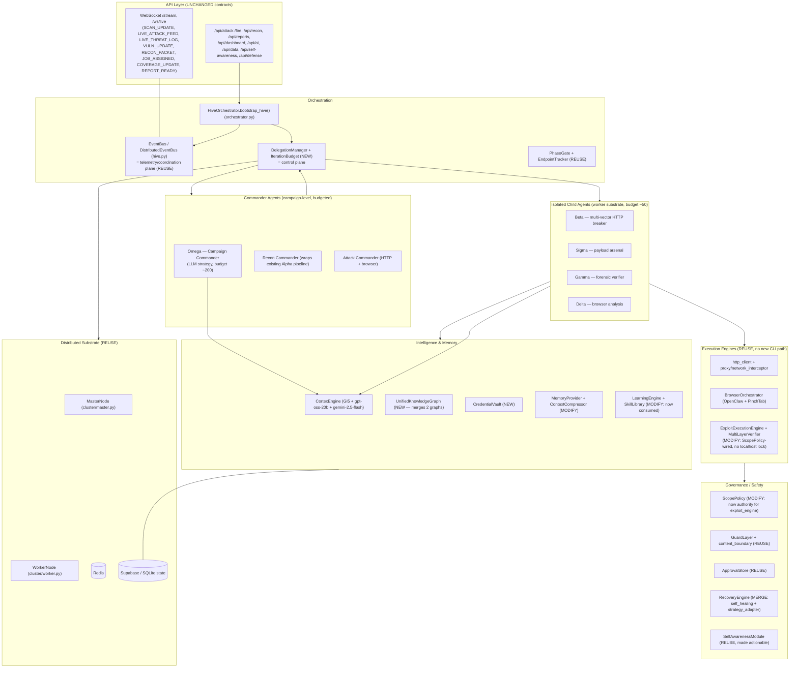
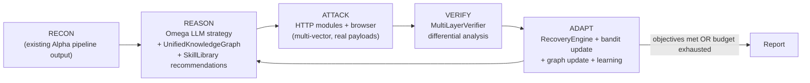

# Vigilagent Core — Technical Design

> A **backend-only** re-architecture of the existing penetration-testing system ("Vulagent") into **Vigilagent**. The goal is to close the architectural and intelligence gaps identified across the five analysis documents (measured against hermes-agent) by adopting hermes-agent's *software patterns* — hierarchical delegation, iteration budgets, context compression, a real memory manager, genuine self-healing/self-awareness, and the elimination of "fake" features — **without turning the system into a CLI/terminal exploitation tool** and **without changing the frontend**.

---

## Overview

The five documents catalogue, in detail, where this system falls short of hermes-agent. Read top to bottom, they cluster into two very different kinds of gaps:

1. **Backend architecture & intelligence gaps** (what this design fixes): flat agent communication with no hierarchical delegation; no iteration budget so agents can run forever; no LLM-powered context compression (memory hard-caps at 1000 entries and overflows); a memory store with no plugin interface or context fencing; "fake" intelligence — Beta's `RL` is a binary log line, Omega's `Nash equilibrium` is `random.choices()`, `strategy_adapter` always returns `SWITCH_TECHNIQUE`, auth recovery is stubbed to return `False`, the skill library and learning engine are write-only and never consumed; two unconnected graph systems; no credential reuse; no checkpoint/resume; the exploit engine is hard-locked to `localhost` because it ignores the perfectly good `ScopePolicy`.

2. **"Become a CLI hacker" gaps** (explicitly OUT of scope per your instruction): real shell/terminal execution of nmap/sqlmap/metasploit/hydra; multi-backend Docker exploitation; OSI L2–L6 network attacks via scapy/crackmapexec/impacket; post-exploitation, C2/session management, reverse shells; a browser session-bridge extension.

**This design addresses category 1 only.** Vigilagent keeps doing exactly what it does today — HTTP-based attack modules, browser-driven analysis (OpenClaw + PinchTab), and the existing Alpha recon pipeline — but with a *dramatically better backend brain*: it reasons hierarchically, budgets itself, remembers intelligently, heals for real, learns from its own findings, and never claims a capability it doesn't have.

### Design Goals

- **Hierarchical autonomy**: commander agents spawn isolated, budget-capped child agents on the existing cluster master/worker substrate (hermes delegate pattern), replacing flat "broadcast and hope" coordination.
- **Bounded execution**: a thread-safe `IterationBudget` shared down the agent hierarchy so no agent (or the whole scan) can run forever.
- **Intelligent memory**: LLM-summarized context compression + a plugin-based memory provider with context fencing, replacing the 1000-entry hard cap.
- **Real, not fake**: replace Beta's fake RL with a real epsilon-greedy bandit, Omega's `random.choices` "Nash" with LLM strategy reasoning, stubbed auth recovery with real re-authentication, and write-only learning with a closed read/write loop.
- **Consolidation**: merge the two graph systems into one, merge the two recovery systems into one, and make the learning/skill systems actually consumed — no duplicate files.
- **Honest scope**: HTTP + browser + existing recon only. No new shell/CLI execution path is added.
- **Two LLMs only**: OpenRouter `openai/gpt-oss-20b` (deep reasoning, arbitration, strategy, reporting) + Google `gemini-2.5-flash` (fast tactical: payloads, validation, narrative, embeddings). GI5 stays as a deterministic *non-LLM* pre-processor/fallback.

### Scope of CLI execution (important clarification)

There is a deliberate, narrow line here:

- **Recon CLI tools ARE used (and used properly).** The ~37 recon tools installed under `D:\projects` (`ALPHA_TOOL_ROOT`) are command-line tools — subfinder, amass, httpx, katana, naabu, nmap, nuclei, ffuf, gowitness, etc. The system already shells out to them today through `backend/core/queue.py::ProcessRunner` and `backend/tools/recon/runner.py::ReconCommandRunner`. This design **consolidates that into a single clean recon execution module (`backend/core/terminal.py`)**, wires in every available tool, and runs them Docker-sandboxed when Docker is available (it is). This is recon, and it stays.
- **Exploitation does NOT become a CLI tool.** We do **not** add a generic shell engine that runs sqlmap / metasploit / hydra / crackmapexec / scapy to *exploit* targets. Exploitation stays on the existing HTTP (`http_client` / `network_interceptor`) and browser (OpenClaw + PinchTab) surface — made *real* via differential verification, multi-vector delivery, and real credential reuse, not by shelling out attack tools.

### Non-Goals (explicit)

- **No frontend changes.** All existing REST routes and WebSocket message shapes remain byte-compatible. New endpoints may be added; existing ones are never changed in a breaking way.
- **No generic exploitation shell.** No universal "run any attack binary" engine. Exploitation stays HTTP + browser (see clarification above). The only CLI execution path is the consolidated **recon** runner.
- **No OSI L2–L6 network attacks, no post-exploitation/C2, no reverse shells, no browser extension.**
- **No third LLM.** Ollama / NVIDIA / NeMo references are designed out.
- **No heavy test suite.** Verification is light: invariant checks + a few smoke tests.

### What "true autonomous hacker" means in this (backend-only) context

A better *brain*, not new *hands*. The system already has the hands (HTTP attack modules, browser automation, recon). Today it uses them reactively and once. Vigilagent makes the backend run an explicit **Recon → Reason → Attack → Verify → Adapt** loop with hierarchical delegation, budgets, real memory, and real learning — so it chains findings, adapts strategy from evidence, and stops when objectives are met or budget is exhausted.

---

## Architecture

### System layers



### The autonomous loop (backend brain, existing hands)



### The two-LLM routing model

```mermaid
graph LR
    A[Agent / Engine] --> RT{LLMRouter.tier_for(agent)}
    RT -->|HIGH: strategy, arbitration,<br/>remediation, reporting| OR["OpenRouter openai/gpt-oss-20b"]
    RT -->|MID/LOW: payloads, validation,<br/>narrative, embeddings| GM["Gemini gemini-2.5-flash"]
    A --> GI5["GI5 deterministic (NON-LLM)<br/>instant pre-pass + fallback"]
    OR --> FUSE[Bayesian fusion in CortexEngine]
    GM --> FUSE
    GI5 --> FUSE
```

Only two network LLM endpoints exist anywhere in the system. `CortexEngine` already wires exactly these two plus GI5; the legacy `_call_ollama` / `_call_nvidia_*` aliases collapse onto `_call_gemini` and the dead third-model branches are deleted.

### Control plane vs coordination plane (reconciling delegation with the flat EventBus)

The flat `EventBus` is **not removed** — it stays as the **coordination/telemetry plane** that drives the frontend WebSocket feed (untouched). A **control plane** is layered on top:

- **Coordination plane (reuse):** agents publish `LIVE_ATTACK`, `VULN_CONFIRMED`, `RECON_PACKET`, etc. The orchestrator's `event_listener` keeps translating these into the exact frontend messages. Unchanged.
- **Control plane (new):** `DelegationManager` provides request/response parent→child calls with isolated memory, budgets, and structured returns. Child agents still *publish* telemetry to the EventBus (so the dashboard lights up), but their *task lifecycle* (assign → run → return result) is managed by the DelegationManager over the master/worker substrate — not by broadcast.

Result: Omega stops "broadcasting a job and hoping Sigma grabs it." It calls `delegation.spawn(AttackCommander, budget=…, context=recon)` and `await`s a typed `ChildResult`, while the dashboard still receives the same live events as today.

---

## Components and Interfaces

### Component Inventory (NEW / MODIFY / REUSE / DELETE)

All paths relative to `d:\Antigravity 2\penetration testing system\backend\`.

#### NEW

| File | Purpose |
|------|---------|
| `core/terminal.py` | Single consolidated recon execution module. Wraps `ProcessRunner` + `DockerSandbox`, runs the ~37 `D:\projects` recon tools (argv arrays), Docker-sandboxed when available, streaming + timeout + guardrail + audit. Replaces the scattered `tools/recon/runner.py` execution path with one engine the recon commander and Alpha both call. **Recon only — not an exploitation shell.** |
| `core/iteration_budget.py` | Thread-safe `IterationBudget` (consume/refund), parent ~200 / commander ~90 / child ~50. ~60-line hermes port. |
| `core/delegation_manager.py` | Parent→child agent spawning with isolated memory, budgets, structured `ChildResult`, interrupt propagation; runs over the existing master/worker substrate. |
| `core/unified_knowledge_graph.py` | One graph merging `graph_engine.py` + `knowledge_graph.py` (adjacency-indexed, persisted). |
| `core/credential_vault.py` | Encrypted, deduplicated credential store; queried before auth attempts; replaces `MOCK_USER_B_TOKEN`. |
| `core/context_compressor.py` | gemini-2.5-flash sliding-window summarizer; protects system prompt + `VULN_CONFIRMED` + last N turns. |
| `core/recovery_engine.py` | Merged self-healing + strategy adaptation + **real** re-authentication via the vault. |
| `agents/commanders/recon_commander.py` | Budgeted commander wrapping the existing Alpha V6 recon pipeline + `terminal.py`. |
| `agents/commanders/attack_commander.py` | Budgeted commander that spawns HTTP/browser attack children from recon results. |
| `config/scope.yaml` | Declarative authorized-target scope. |
| `config/budgets.yaml` | Per-role iteration budgets. |

#### MODIFY

| File | Change |
|------|--------|
| `core/exploit_engine.py` | Delete `ALLOWED_DOMAINS` + `_is_allowed_domain()`; route every request through `ScopePolicy.assert_allowed()`. Keep `MultiLayerVerifier` + `AdaptivePlanner`. |
| `core/scope.py` | Add `from_yaml()`, CIDR + engagement-window + `authorized` master switch; become the single scope authority for HTTP, browser, exploit engine, and recon. |
| `tools/recon/runner.py` | Becomes a thin shim over `core/terminal.py` (no duplicate subprocess logic); keep the DB toolcall logging it already does. |
| `tools/recon/registry.py` | Source of truth for the full tool matrix; ensure all installed `D:\projects` tools are represented and availability-checked. |
| `agents/alpha.py` + `agents/alpha_v6/*` | Call `terminal.py` for execution instead of the standalone runner path; no behavioral change to recon phases. |
| `agents/beta.py` | Replace fake "RL" (binary `reward`/log lines) with a real epsilon-greedy `PayloadBandit`; add multi-vector HTTP delivery (query/body/headers/cookies/path); reuse one pooled `aiohttp` session instead of `ClientSession()` per request. Stays HTTP/browser. |
| `agents/omega.py` | Replace `_generate_mixed_strategy` `random.choices()` "Nash" with gpt-oss-20b strategy reasoning consuming the unified graph + recon; replace the hardcoded `hypotheses` list with evidence-derived hypotheses; wire (or delete) the dead `_plan_browser_campaign`. |
| `agents/sigma.py` | Real WAF-evasion mutations (beyond base64/hex/url). Stays HTTP. |
| `core/planner.py` | Pre-planning step queries `SkillLibrary.get_recommendations()` + the unified graph. |
| `core/memory.py` | Replace the 1000-entry hard cap with compressor-backed eviction behind a `MemoryProvider` interface; keep the dual-store API and `memory_store` singleton. |
| `core/learning_integrator.py` | Add the missing read path (pull recommendations OUT to agents). |
| `core/state.py` | Add checkpoint/resume. |
| `modules/tech/*`, `modules/logic/*` | Replace `if "admin"/"success" in text` detection with differential analysis + `MultiLayerVerifier`; Doppelganger uses vault tokens. |
| `ai/cortex.py` | Collapse `_call_ollama` / `_call_nvidia_*` onto `_call_gemini`; delete dead third-model branches and the misleading Ollama header comment; keep GI5 + 2-LLM fusion. |
| `core/config.py` | Add `VIGILAGENT_*` settings with backward-compatible `VULAGENT_*` aliases; add terminal/budget/vault config. |
| `core/cluster/worker.py` | Extend the module map so workers can run child-agent tasks (not just the 9 legacy modules). |
| `core/cluster/master.py` | Import the unified graph instead of `graph_engine.GraphEngine`. |
| `main.py` | Rename user-facing banners/title to Vigilagent (strings only); no route changes. |

#### REUSE as-is

`core/hive.py` (EventBus), `core/queue.py` (`ProcessRunner`/`CommandLane` — now priority-aware), `core/sandbox.py` (`DockerSandbox`/`TempWorkspace`), `core/tool_registry.py` + `core/tool_executor.py`, `core/guard_layer.py`, `core/content_boundary.py`, `core/proxy.py`, `core/browser_orchestrator.py` + `openclaw_engine.py` + `pinchtab_engine.py`, `core/forensic_collector.py`, `core/reporting.py` + `reporting/*`, `parsers/recon/*`, `tools/recon/commands.py` + `guardrails.py`, `core/phase_gate.py`, `core/endpoint_tracker.py`, `core/approval.py`, `core/self_awareness_module.py`, `core/agent_health_monitor.py`, `api/*`, `core/cluster/{master,worker}.py` (with the import tweaks above).

#### DELETE / collapse (de-duplication)

| Removed | Absorbed into |
|---------|---------------|
| `core/graph_engine.py` **and** `core/knowledge_graph.py` | `core/unified_knowledge_graph.py` (with temporary back-compat aliases `graph_engine` / `knowledge_graph` during migration, removed in the final phase). |
| `core/strategy_adapter.py` (always returns `SWITCH_TECHNIQUE`) | `core/recovery_engine.py`. |
| `core/self_healing_engine.py` recovery + stubbed `_handle_auth_error` | `core/recovery_engine.py` (real auth recovery via vault). |
| Dead `_call_ollama` / `_call_nvidia_*` branches in `ai/cortex.py` | routed to `_call_gemini` / removed. |
| `ALLOWED_DOMAINS` in `exploit_engine.py` | `ScopePolicy`. |
| `MOCK_USER_B_TOKEN` in `modules/logic/doppelganger.py` | `CredentialVault`. |
| Duplicate subprocess logic in `tools/recon/runner.py` | `core/terminal.py`. |

> **Consolidation rule:** no NEW file may duplicate an existing capability. Before creating any NEW file, confirm no existing module already provides ≥70% of the behavior; if it does, extend that module.

---

## Data Models

All models are Pydantic v2 / dataclasses matching the existing `HiveEvent` / `protocol.py` style.

### Scope configuration (`config/scope.yaml` → `ScopePolicy`)

```yaml
engagement:
  name: "acme-q2"
  authorized: true            # master switch: false => recon/passive only
  window_start: "2026-05-01T00:00:00Z"
  window_end:   "2026-06-30T23:59:59Z"
scope:
  allowed_hosts:   ["app.acme.com", "api.acme.com"]
  allowed_cidrs:   ["203.0.113.0/24"]
  allowed_url_globs: ["https://*.acme.com/*"]
  denied_url_globs:  ["*/logout*", "*/admin/delete*"]
  allow_private_networks: false
limits:
  max_rps: 50
```

`ScopePolicy` (extends `scope.py`): adds `allowed_cidrs`, `window_start/end`, `authorized`, `from_yaml()`. `allows(url)` keeps existing glob/host semantics plus CIDR + window checks.

### IterationBudget (`core/iteration_budget.py`)

```python
class IterationBudget:
    def __init__(self, max_total: int): ...
    @property
    def remaining(self) -> int: ...
    def consume(self, n: int = 1) -> bool      # thread-safe; False if exhausted
    def refund(self, n: int = 1) -> None       # refund LLM-only / no-op turns
    def child(self, max_total: int) -> "IterationBudget"   # independent child budget
    def exhausted(self) -> bool: ...
```

### Delegation contracts (`core/delegation_manager.py`)

```python
class ChildSpec(BaseModel):
    agent_class: str            # "AttackChild", "ReconChild"
    tools: list[str]            # allowlisted tools for this child
    budget: int
    objective: str
    context: dict               # recon findings, target, scope ref
    timeout_s: int = 600

class ChildResult(BaseModel):
    child_id: str
    status: Literal["completed","failed","budget_exhausted","cancelled","timeout"]
    findings: list[dict] = []   # normalized → become VULN_CONFIRMED events
    artifacts: list[str] = []
    summary: str = ""
    budget_used: int = 0
    error: str = ""
```

### ReconRun (`core/terminal.py`)

```python
class ReconToolResult(BaseModel):
    tool: str
    argv: list[str]
    backend: Literal["local","docker"]
    exit_code: int | None
    output_path: str
    parsed_entities: int
    stderr_tail: str
    timed_out: bool
    duration_ms: int
    sha256: str
    scan_id: str
```

### Credential (`core/credential_vault.py`)

```python
class Credential(BaseModel):
    cred_id: str                # sha256(target|service|principal) for dedup
    scan_id: str
    target: str
    service: str                # http, jwt, api, cookie...
    principal: str | None
    secret_enc: str             # Fernet-encrypted (reuse forensic_collector pattern)
    kind: Literal["password","token","jwt","cookie","api_key"]
    source: str                 # recon | browser | response | manual
    privilege: Literal["unknown","user","admin"] = "unknown"
    captured_at: datetime
```

### Checkpoint (`core/state.py`)

```python
class Checkpoint(BaseModel):
    scan_id: str
    phase: str                  # PhaseGate phase
    completed_endpoints: list[str]
    pending_endpoints: list[str]
    findings: list[dict]
    graph_snapshot: dict        # UnifiedKnowledgeGraph.to_dict()
    budgets: dict[str, int]
    created_at: datetime
```

### UnifiedKnowledgeGraph (`core/unified_knowledge_graph.py`)

Superset of both existing graphs. Node kinds: `HOST, SERVICE, ENDPOINT, PARAMETER, VULN, CREDENTIAL, TECH, FINDING, BROWSER_ENDPOINT, JS_ROUTE`. Edge kinds: `serves_endpoint, has_param, has_vuln, validates, leads_to, escalates_to, http_equivalent, authenticates`. Keeps the strong parts of both: `knowledge_graph.py`'s typed `stable_id` upsert + browser linking, and `graph_engine.py`'s `CHAIN_RULES` + `find_chains` DFS + weight pruning + JSON persistence — but with an **adjacency index** so lookups are O(1) instead of full-set scans.

```python
class UnifiedKnowledgeGraph:
    def upsert_node(self, kind, label, **props) -> str: ...
    def link(self, src_id, dst_id, kind, weight=1.0): ...
    def ingest_http_record(self, record, scan_id): ...     # from RECON_PACKET
    def ingest_finding(self, finding, scan_id): ...         # from VULN_CONFIRMED
    def predict_next(self, node_id) -> list[tuple[str,float]]: ...
    def find_chains(self, max_depth=5) -> list[dict]: ...    # CHAIN_RULES-guided DFS
    def to_dict(self) / from_dict(d): ...                    # persistence + checkpoint
```

---

## Low-Level Design

### Control plane vs coordination plane

The flat `EventBus` stays as the **coordination/telemetry plane** that drives the frontend WebSocket feed (untouched). A **control plane** is layered on top: `DelegationManager` gives parent→child request/response calls with isolated memory, budgets, and structured returns. Child agents still *publish* `LIVE_ATTACK` / `VULN_CONFIRMED` to the EventBus (so the dashboard lights up exactly as today), but their *task lifecycle* is managed by the DelegationManager over the master/worker substrate. Omega calls `delegation.spawn(AttackCommander, budget=…, context=recon)` and `await`s a typed `ChildResult` instead of broadcasting a job and hoping an agent grabs it.

### `core/terminal.py` — consolidated recon execution (recon only)

```python
class ReconTerminal:
    """Single audited path for recon CLI tools. Wraps ProcessRunner + DockerSandbox.
       NOT an exploitation shell — only registered recon binaries run here."""
    def __init__(self, scope: ScopePolicy, prefer_docker: bool = True): ...

    async def run(self, cmd: ReconCommand, *, scan_id: str, agent: str,
                  budget: IterationBudget) -> ReconToolResult:
        # 1. budget.consume() else abort
        # 2. validate_command(cmd.argv)  (reuse tools/recon/guardrails — argv only, no shell)
        # 3. if cmd targets a host/url: scope.assert_allowed(target)
        # 4. backend = docker if prefer_docker and docker available else local
        # 5. async with command_lane.slot(LanePriority.NORMAL):
        #        DockerSandbox(...).run(...)  OR  ProcessRunner.run_exec(argv, ...)
        # 6. parse via parsers/recon/* by cmd.parser_hint
        # 7. audit via db_manager.create_toolcall/finish_toolcall
        # 8. return ReconToolResult
```

Key points: argv arrays only (guardrails already reject shell metacharacters); Docker default since Docker Desktop is running, `local` fallback for tools not in the image; reuses the existing `parsers/recon/*` registry and DB toolcall logging. `tools/recon/runner.py` becomes a thin shim calling this, removing duplicate subprocess code.

### ScopePolicy ↔ exploit_engine wiring (highest-impact fix)

```python
# core/exploit_engine.py (MODIFY)
class ExploitExecutionEngine:
    def __init__(self, scope: ScopePolicy | None = None):
        self.scope = scope or scope_guard
    async def execute_plan(self, plan):
        try:
            self.scope.assert_allowed(plan.endpoint, action="exploit")
        except ScopeViolation:
            self._telemetry["blocked_unsafe"] += 1
            return None
        ...  # rest unchanged; MultiLayerVerifier retained
```

`ALLOWED_DOMAINS` / `_is_allowed_domain()` deleted. Scope is built once in `bootstrap_hive()` from `scope.yaml` (or `ScopePolicy.from_target(url)` when no YAML, preserving today's single-target behavior) and injected into the exploit engine, `http_client`, browser, and `ReconTerminal`.

### DelegationManager + budget

```python
class DelegationManager:
    def __init__(self, bus: EventBus, master: MasterNode | None): ...
    async def spawn(self, spec: ChildSpec, parent_budget: IterationBudget) -> ChildResult:
        child_budget = parent_budget.child(spec.budget)        # independent
        if self.master:                 # distributed: enqueue to worker, await result key
            return await self._run_on_worker(spec, child_budget)
        child = build_child_agent(spec, child_budget, self.bus) # clean isolated memory
        try:
            return await asyncio.wait_for(child.run(spec.context), spec.timeout_s)
        except asyncio.CancelledError:
            await self._cancel_subtree(spec); raise            # interrupt propagation
```

Child budgets are independent (a child cannot drain the parent), matching hermes. When Redis is present, `spawn` enqueues onto `worker_queue:{id}` (reusing `MasterNode.distribute_tasks`) and `WorkerNode.execute_task` is extended to instantiate child agents.

### Beta: real bandit + multi-vector (replacing fake RL)

```python
class PayloadBandit:
    # key = (vuln_class, vector, payload_family) -> {tries, hits}
    def select(self, vuln_class, epsilon=0.15) -> Payload   # explore vs exploit by hit-rate
    def update(self, key, success: bool)                     # real reward from verifier

class PayloadDeliveryEngine:
    VECTORS = ("query","json_body","form_body","header","cookie","path")
    async def deliver(self, target, payload, vectors, session) -> list[Response]
```

Detection becomes differential: baseline request vs injected request compared by `MultiLayerVerifier.verify()` (status divergence, length delta, Jaccard < 0.85, new sensitive keyword, JSON structural diff). The current binary `reward = 1.0 if verified else 0` with log lines is replaced by `bandit.update(key, success)` driving future `select()`.

### Omega: LLM strategy (replacing fake Nash)

`_generate_mixed_strategy`'s `random.choices(strategies, weights=…)` is replaced by a single gpt-oss-20b (HIGH tier) call that consumes the `UnifiedKnowledgeGraph` summary + recon tech-stack + defense pressure and returns a structured strategy choice + module ordering. The hardcoded `hypotheses` list is replaced by hypotheses derived from real recon/graph evidence. GI5 deterministic ranking is the fallback when the circuit breaker is open.

### Context compressor

```python
class ContextCompressor:
    def __init__(self, max_tokens=24000, keep_last=20): ...
    async def compress(self, transcript: list[str]) -> list[str]:
        # protect: system prompt, all VULN_CONFIRMED lines, last keep_last turns;
        # summarize the middle via gemini-2.5-flash (MID tier) into one block
```

`memory.py`'s `remember_episode` 1000-entry hard slice (`rows[-1000:]`) is replaced by compressor-backed eviction behind a `MemoryProvider` interface, preserving the `memory_store` API and the cosine-similarity semantic recall.

### Recovery engine (real, not stubbed)

`recovery_engine.py` merges `self_healing_engine.py` (circuit breaker, restart callbacks) with `strategy_adapter.py` (which currently always returns `SWITCH_TECHNIQUE`). Real behaviors:
- **Auth recovery:** on 401/403/session expiry, pull a fresh credential from the vault and re-authenticate — replacing the stub that returned `False`.
- **Strategy adaptation:** real selection among `RETRY | SWITCH_VECTOR | DELEGATE | REDUCE_RATE | ABORT` based on error class + diminishing returns.
- **Cross-context learning:** writes a real pattern to `SkillLibrary` that the planner reads (closing the write-only loop).

### LLM usage

Everything routes through the existing two clients via `CortexEngine` / `LLMRouter`: HIGH tier → `openrouter_client` (`openai/gpt-oss-20b`) for strategy/arbitration/remediation/reporting; MID/LOW → `gemini_client` (`gemini-2.5-flash`) for payloads/validation/narrative/embeddings. The dead `_call_ollama` / `_call_nvidia_*` aliases are collapsed onto `_call_gemini`; no other model endpoint exists.

---

## Correctness Properties

Formal invariants Vigilagent must uphold; each is checkable at runtime (fail-closed) and/or via a light property test.

### Property 1: Scope containment

No out-of-scope request is ever issued. Every outbound HTTP request, browser navigation, and recon command targeting a host passes `ScopePolicy.allows(target)` before execution. Enforced in `scope.py`, `exploit_engine.py`, `terminal.py`, `proxy.py`, `http_client`, browser orchestrator.

### Property 2: Two-LLM exclusivity

The only network LLM endpoints reachable are OpenRouter (`openai/gpt-oss-20b`) and Gemini (`gemini-2.5-flash`). No third model is ever called. Enforced in `ai/cortex.py`, `ai/openrouter.py`, `ai/gemini.py`.

### Property 3: Budget boundedness

A child agent never exceeds its assigned budget, and a child can never consume the parent's budget. Enforced in `iteration_budget.py`, `delegation_manager.py`.

### Property 4: No exploitation shell

The only CLI execution path is `terminal.py`, and it only runs binaries in the recon allowlist. No code path shells out to run an exploitation tool against a target. Enforced in `terminal.py` + `tools/recon/guardrails.py` allowlist.

### Property 5: Frontend contract invariance

Every existing REST route and WebSocket message type keeps its shape; new messages are additive only. Enforced in `api/*`, `socket_manager.py`, and the `orchestrator.py` event listener.

### Property 6: No shell strings

No recon command reaches the OS as a shell string. All execution uses argv arrays; shell metacharacters are rejected. Enforced in `tools/recon/guardrails.py`, `terminal.py`.

### Property 7: Evidence-based confirmation

A finding is only marked `VULN_CONFIRMED` when ≥2 independent verification signals agree (`MultiLayerVerifier`), never on a single string match. Enforced in `exploit_engine.py`, `modules/*`, `beta.py`, `gamma.py`.

### Property 8: Authorization gate

If `scope.authorized` is false or the current time is outside the engagement window, no exploitation runs — the system degrades to recon/passive only. Enforced in `scope.py`, `bootstrap_hive`.

### Property 9: Idempotent dedup

The same credential, graph node, or finding is never stored twice (stable hashed IDs). Enforced in `credential_vault.py`, `unified_knowledge_graph.py`, existing dedupe.

### Property 10: No fake intelligence

Every shipped "intelligent" feature is backed by real computation: Beta's adaptation is a real bandit (not a log line), Omega's strategy is a real LLM decision (not `random.choices`), auth recovery actually re-authenticates (not `return False`), and learning/skills are read back by the planner (not write-only). Enforced in `beta.py`, `omega.py`, `recovery_engine.py`, `planner.py`.

---

## Error Handling

- **Authorization-first:** `bootstrap_hive()` loads scope; if `authorized=false` or outside window, the system runs recon/passive only and emits a clear `LOG` event (Property 8).
- **Approval gates:** state-changing HTTP and any destructive action require an `ApprovalStore` ticket via the existing flow.
- **Guardrails:** `tools/recon/guardrails.py` (argv validation, dangerous-pattern + homograph + base64 detection) gates recon; `guard_layer.py` + `content_boundary.py` continue to sanitize LLM I/O and findings.
- **Degradation:** Redis down → local `EventBus` + in-process delegation; Gemini/OpenRouter down → GI5 deterministic fallback (existing circuit breaker); Docker down → `local` recon backend.
- **Audit:** every recon execution and credential access writes a DB toolcall record + `decision_logger` entry.
- **Resource safety:** `CommandLane` concurrency cap, memory pressure checks in `WorkerNode`/`browser_orchestrator`, compressor-bounded transcripts.

---

## Testing Strategy

Intentionally light.

- **Invariant assertions in code:** Properties 1–10 are enforced at call sites (fail-closed), so most "tests" are structural.
- **Smoke tests (few):**
  - Scope: out-of-scope URL blocked; in-scope allowed; `authorized=false` blocks exploitation.
  - Budget: child exhaustion stops; parent budget untouched.
  - Two-LLM guard: static check asserts no third-model endpoint exists in `ai/`.
  - Recon terminal: a known tool runs in both backends; shell-string argv rejected.
  - Frontend contract: snapshot asserts the WebSocket message types emitted by `event_listener` are unchanged.
- **Runtime self-check on boot:** log scope authorization, recon tool availability (`check_tool_availability`), Docker availability, and which of the two LLMs are configured.
- Existing `tests/` keep running; no large new suite added.

---

## Branding (Vulagent → Vigilagent)

- **User-facing only:** banners, FastAPI `title`, log prefixes, report headers → "Vigilagent".
- **Env vars:** add `VIGILAGENT_*` read with fallback to `VULAGENT_*` (`VIGILAGENT_SANDBOX_IMAGE`→`VULAGENT_SANDBOX_IMAGE`, `VIGILAGENT_TEST_MODE`→`VULAGENT_TEST_MODE`) so existing `.env` files keep working.
- **Stable identifiers (DO NOT rename):** Supabase table names, Redis channel `xytherion_events` and queue keys, agent `source` strings, scan-id prefixes (`HIVE-V5-…`), and anything the frontend matches on. Renaming these breaks persistence, the cluster, and the frontend.

---

## Phased Migration Strategy

**Phase 1 — Unlock + consolidate recon execution.**
1. `ScopePolicy` ↔ `exploit_engine.py` wiring + `scope.yaml` (delete localhost lock).
2. `IterationBudget`.
3. `core/terminal.py` consolidating recon execution (Docker-optional); `tools/recon/runner.py` → shim; ensure all `D:\projects` tools wired + availability-checked.
4. Branding pass + `ai/cortex.py` dead-model cleanup.

**Phase 2 — Hierarchical brain.**
5. `DelegationManager`; Recon + Attack commanders; control-plane reconciliation with EventBus.
6. `UnifiedKnowledgeGraph` (merge two graphs); update `omega`/`planner`/`master` imports.
7. Omega LLM strategy + planner consumes `SkillLibrary`.

**Phase 3 — Real attack quality + recovery.**
8. Beta bandit + multi-vector; rewrite `modules/*` detection with verifier; `CredentialVault`; Doppelganger real tokens.
9. `RecoveryEngine` (merge self-healing + strategy-adapter; real auth recovery).

**Phase 4 — Resilience + final consolidation.**
10. `ContextCompressor` + `memory.py` rework.
11. Checkpoint/resume in `state.py`.
12. Remove temporary graph back-compat aliases.

Each phase is independently shippable and leaves the system runnable; the frontend works throughout.

---

## Design Decisions & Trade-offs

- **Keep the flat EventBus instead of replacing it.** A full hierarchical rewrite is cleaner in theory, but the frontend's live feed is wired to EventBus broadcasts. Layering a control plane on top is lower-risk and preserves the frontend contract. Trade-off: two planes; mitigated by a clear rule (EventBus = telemetry, DelegationManager = task lifecycle).
- **Recon CLI yes, exploitation CLI no.** This is the explicit line you drew. The 37 recon tools are genuinely CLI and already used; consolidating them into `terminal.py` is honest. Turning exploitation into a sqlmap/metasploit shell-runner is what we deliberately avoid — exploitation stays HTTP + browser and gets *real* via verification + multi-vector + credential reuse. Trade-off: exploitation depth is bounded by what HTTP/browser can express (no binary RCE), which is acceptable for a web-focused pentester.
- **One `terminal.py` + declarative `ReconCommand` objects, not per-tool wrapper files.** Avoids the file proliferation you warned against; reuses the existing `parsers/recon/*` registry. Trade-off: less per-tool encapsulation.
- **Merge graphs with temporary aliases.** Merging mid-flight risks regressions in omega/sigma/planner/master; short-lived back-compat aliases de-risk it, removed in Phase 4. Trade-off: brief shim code.
- **Epsilon-greedy, not deep RL, for Beta.** True policy-gradient RL won't converge within one engagement and is slow. A bandit over (vuln_class, vector, payload_family) is real, explainable adaptation now — and we stop calling it "RL" falsely.

### Open Questions

1. **scope.yaml precedence:** per-scan upload via the existing `/api/attack/fire` payload, a repo file, or both (payload overrides file)?
2. **Docker recon image:** build one `Dockerfile.vigilagent-recon` (Kali-style) bundling the 37 tools, or bind-mount `D:\projects` into a slim image / run locally when a tool isn't containerized?
3. **Exploitation autonomy default:** within an authorized scope, should HTTP state-changing attacks auto-run or require a first-time approval click?
4. **Confirm cut scope:** OSI L2–L6 network attacks, post-exploitation/C2, and the browser session-bridge extension stay OUT — correct?
